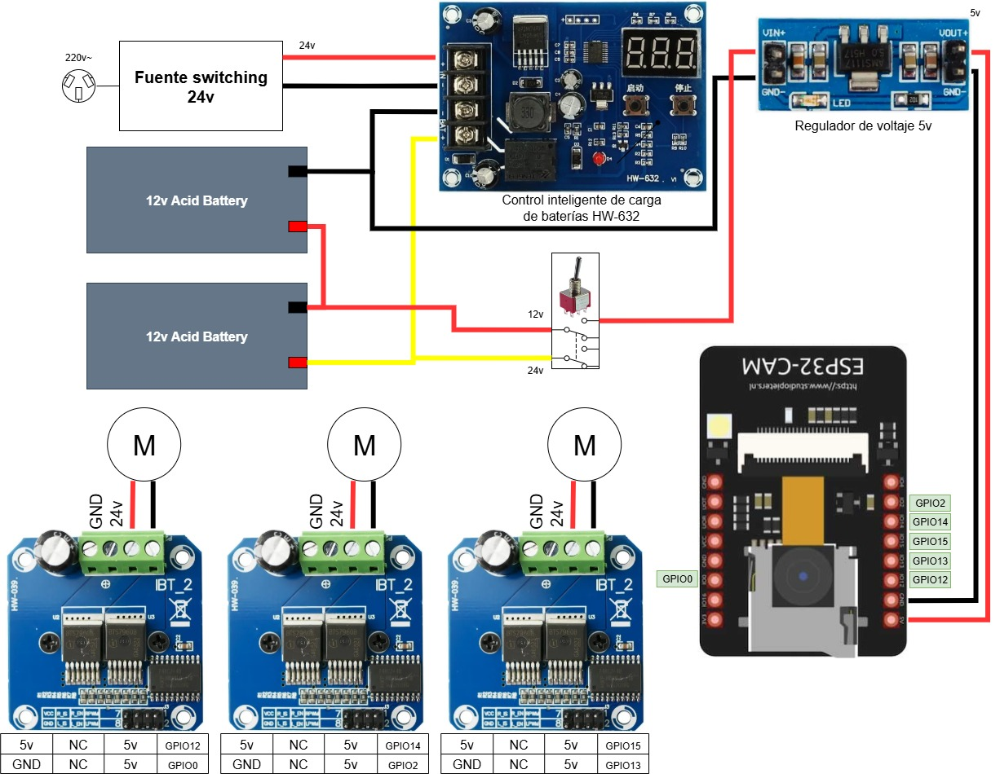

# Proyecto Robotino CFP Nº8

## Contexto
Este proyecto fue desarrollado en el FABLAB del __Centro de Formación Profesional Nº8 - SMATA__. Se realizó una adaptación de la electrónica y el firmware del robot colaborativo __Robotino v1__, de la firma __FESTO__. En el proyecto, se reutilizó el chasis original del robot y sus motores.

## Cómo funciona?
El robot funciona mediante una placa ESP32cam en modo _WIFI AP_, la cual maneja el accionar de los motores y su cámara mediante una interfaz web. Ademas de la inspección mediante su camara, el usuario puede modifica la velocidad del andar del robot.

## Circuito

## Lista de materiales
- ESP32 cam	(1)
- Driver controlador de motor de alta potencia __BTS7960__ (3)
- Módulo regulador de voltaje 5v	(1)
- Placa controladora de carga de baterías __HW-632__	(1)
- Batería de Acido 24v recargable	(2)

## Cómo se usa?
- Una vez hecho el circuito y cargado el [firmware](./firmware/firmware_robotino_cfp8.ino) en la placa __ESP32cam__, encender el equipo.
- Conectarse a la señal de wifi (_SSID: robotino/password: 01620162_) abrir el navegador web e ingresar el IP [192.168.1.4](192.168.1.4)
- Listo, ya se puede interactuar con el robot.
